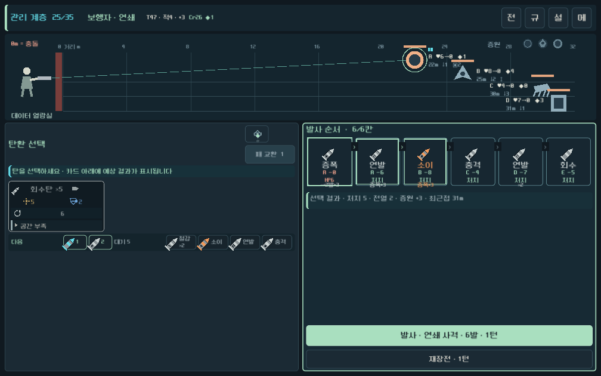
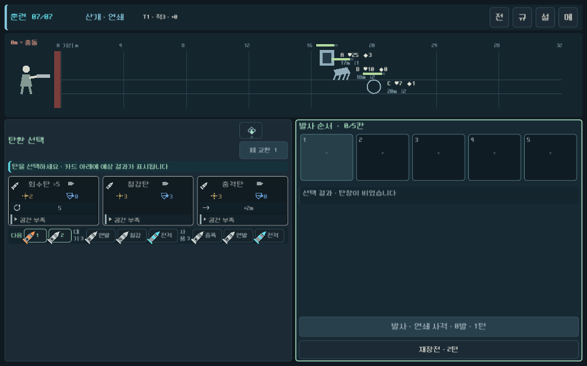

# 전투 전체 화면 UI QA — 2026-09-26

## 범위

전투 상태 바, 전장, 탄환 선택, 발사 순서, 압축·교환 도구, 발사·재장전의 1008×630 모바일 가로 배치를 검증했다. 전투 규칙과 수치 변경은 범위에 포함하지 않았다.

## 자동 검증

| 검사 | 결과 |
| --- | ---: |
| 전체 자동 회귀 | 3,730 / 실패 0 |
| 무기별 OpenGL UI | 390 / 실패 0 |
| 캠페인 6칸 탄창 레이아웃 | 495 / 실패 0 |

무기별 UI 러너는 작은 화면에서 세로 스크롤바가 숨겨졌는지 확인하고 `CombatStatusBar`, `BattleView`, `CombatWorkbench`가 모두 뷰포트 안에 들어오는지 검사한다.

## 시각 확인

### 실제 캠페인 6칸 탄창

### 산개 훈련 전투

확인 결과 상단 메뉴는 우측 정렬됐고, 다수 적과 6칸 발사 순서, 발사·재장전 버튼이 1008×630 안에 유지됐다.

## 참고

OpenGL 캡처는 `gl_compatibility` 렌더러와 화면 밖 창 위치에서 수행했다. 격리된 사용자 데이터 경로를 사용해 실제 플레이 저장은 건드리지 않았다. 루트 인증서 저장소 경고는 네트워크를 사용하지 않는 로컬 렌더링 검사와 무관하며 테스트 결과에 영향을 주지 않았다.

## Android 패키지

- 파일: `builds/city-android/LastOnBoard-city.apk`
- 버전: `0.4.20260926` (`versionCode 20260926`)
- 패키지: `com.lastonboard.prototype`
- ABI: `arm64-v8a`, `armeabi-v7a`
- 서명: Android 디버그 인증서, APK Signature Scheme v2·v3 확인
- 정렬: 4바이트 및 16KiB 공유 라이브러리 정렬 확인
- SHA-256: `3C13488A2B05DB5B15DAC25D9073A037297FDF5D6A0C1DCF3039A19A3BD454E3`
