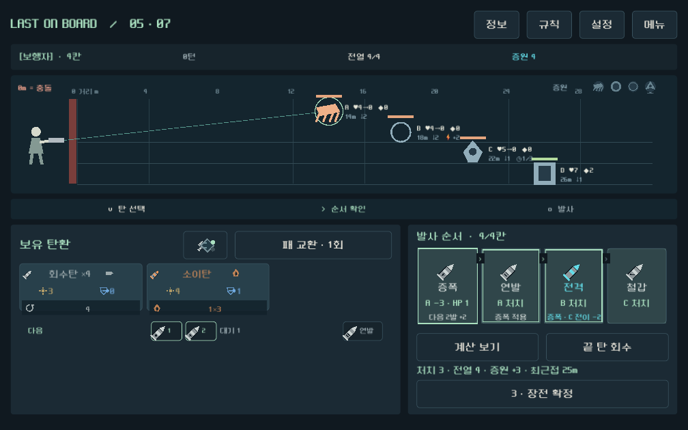
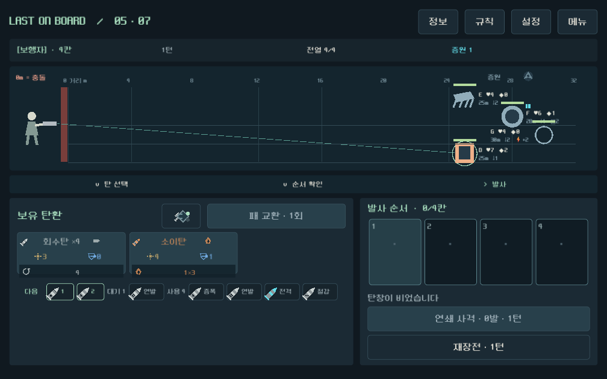
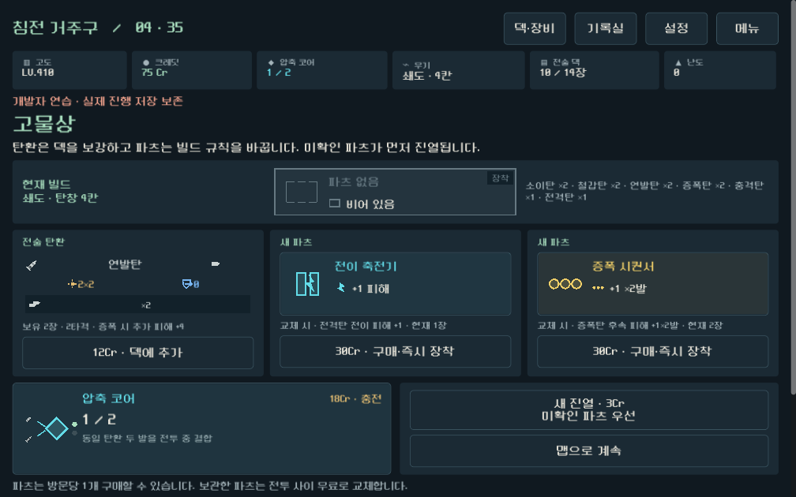
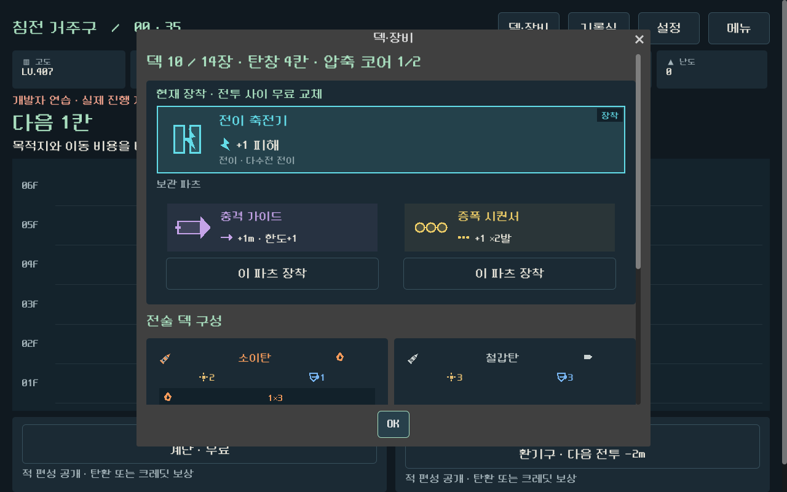
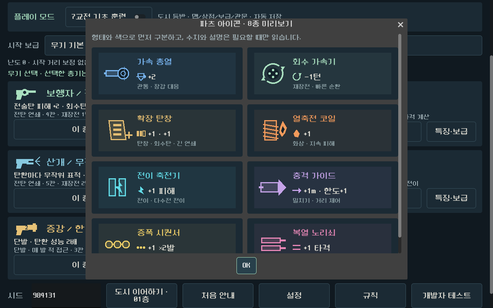

# 고정 전열·탄 순서·파츠 UX QA 보고서

검증일: 2026-09-21  
대상 브랜치: `prototype/core-redesign`  
화면 기준: 1008×630

## 판정

**자동 기능 검증 통과.** 사용자 피드백에서 지적된 전열 재배치, 기본탄 과성능, 적 전술 정보 부족, 파츠 반복, 상점·보관함 비교 불편을 재현 가능한 규칙과 UI 검사로 고정했다.

## 결과

| 검사 | 범위 | 결과 |
|---|---|---:|
| 무기 규칙 | 기본/전술 피해, 약점, 8종 파츠 효과 | 3,215 / 0 실패 |
| 다수전 규칙 | 고정 레인, 빈 레인 증원, 사망·이동 후 위치 | 144 / 0 실패 |
| 캠페인 | 2시드 × 2무기 × 안전/혼합 35층 | 22,016 / 0 실패 |
| 실제 UI | 상점, 보관함, 구매·장착, 단발·연발 완주 | 3,477 / 0 실패 |
| 실제 입력 | 클릭·선택·구매·교체·진행 | 1,124 행동 |
| 가독성 정산 | 순서별 피해, 예고, 저장 변환 | 30,068 / 0 실패 |
| 다수전 UI | 계획·증원 후 모바일 화면 | 20 / 0 실패 |

## 시각 확인

### 전투 계획과 고정 레인

### 상점과 장비 보관함

### 파츠 아이콘 체계

## 남은 판단

사람 플레이에서 다음 세 항목을 확인한다.

1. 회수탄 약화 뒤 전술탄을 고르는 이유가 전투 화면만으로 전달되는가.
2. 약점과 상태를 보고 실제로 발사 순서를 바꾸게 되는가.
3. 상점에서 파츠 후보를 비교하고 빌드를 바꾸는 과정이 짧고 만족스러운가.

자동 완주 결과를 재미 승인으로 사용하지 않는다. 이번 검증에서는 APK와 Windows 패키지를 생성하지 않았다.
