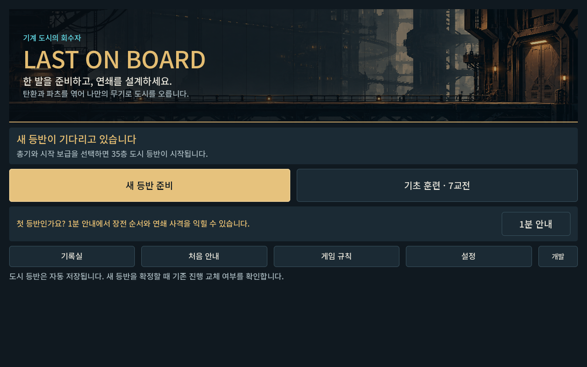
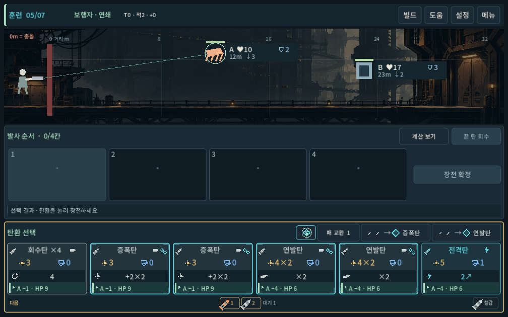
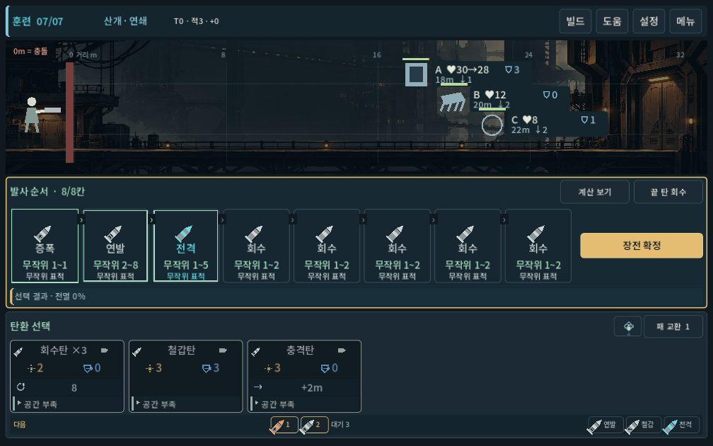
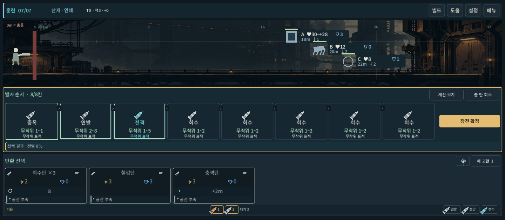
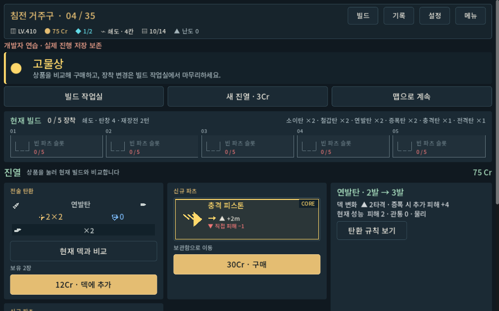

# 디렉터 리빌딩 — 적용과 검증

2026-10-02 · `prototype/core-redesign` · 기준 HEAD `538054d` 위의 작업 중 변경 포함.

## 결과와 범위

과거 기획을 고정하던 역할 스킬과 실제 실행 중인 게임 사이의 기준을 다시 정리했다. 탄환 순서·무기 개성·파츠 빌드·압축 경제를 핵심으로 확정하고, 기계 도시의 회수자와 산업 그래픽 아트 방향을 마련했다. 메인부터 결과까지 각 화면의 결정과 정보 위계를 새로 정의했다.

실행 게임에는 공통 산세리프 글꼴, 황동색 주 행동, 생성한 도시 배경, 전장/발사 레일/손패의 전체 폭 구도를 적용했다. 상점·장비·지도도 공통 활자를 사용한다. 모든 화면에 고유 원화가 들어간 최종 아트 빌드는 아니다.

## 기준 충돌 해결

- 실제 세션이 읽는 `D:/ProjectLoB/.agents`와 활성 개편판 `.agents`의 역할 스킬 12개를 같은 내용으로 갱신했다.
- Creative Director의 과거 LIFO·서사 고정, 시뮬레이터의 무작위 배제·옛 명중 규칙, Art Director의 충돌하는 금지/권장 내용, 구형 CSV 가정을 현행 기준과 분리했다.
- 스킬은 작업 절차를 담당하고 게임 결정은 `docs/direction`에 둔다. 사용자 확정 핵심, 새 디렉터 결정, 구현 상태, 검증할 가설을 구분한다.
- 보조 경험 평가 문서 3개도 두 위치에서 수정했다. 동일 자동 프로필 수를 독립적인 인간 평가로 취급하지 않는다.
- 기존 원문 36건은 스냅샷과 SHA-256으로 보존했다. 과거 버그 보고·GDD·이력은 역사 자료로 남는다.

## UI 수정의 원인과 효과

- 반으로 나뉜 긴 전투 패널을 전장 → 발사 레일 → 손패 순서로 재배치했다. 기본 가로 화면에서 손패 6개를 한 줄로 보여 준다.
- 물리 창 높이와 논리 UI 높이를 섞던 조건을 수정했다. 1280×800, 1008×630, 1440×630의 최대 8칸 탄창과 6개 손패/압축 도구가 화면에 들어간다.
- 편집 버튼의 줄바꿈이 최소 폭을 줄여 세로로 늘어나던 문제, 압축 도구의 불필요한 세로 줄바꿈을 수정했다.
- 적 정보판은 HP와 장갑 방패 기호를 분리했다. 배경 격자를 약화하고 실제 공격·이동 애니메이션은 기존 상태를 사용한다.
- 카드의 결과 한 줄에서 효과 문구 반복을 덜었다. 효과 수치는 카드 본문, 발사별 결과는 레일, 상세 계산은 기존 상세 기능에 남는다.
- 주 행동 버튼의 키보드 포커스 글자색 대비를 수정했다.

## 검증 증거

Godot 4.7, Windows OpenGL Compatibility 실제 렌더, 격리된 QA 저장을 사용했다.

| 검사 | 결과 | 범위 |
| --- | --- | --- |
| 현행 무기 규칙 | 3,245건 / 실패 0 | 무기·탄환·파츠·저장 유효성 |
| 무기 UI | 390건 / 실패 0 | 5종 무기, 정상 시작·복원, 실제 터치, 7·8칸 탄창 |
| 전체 캠페인 UI | 3,698건 / 실패 0, 입력 1,186회 | 보행자·쇄도 재생, 지도·보상·상점·장비·압축·6칸 탄창 |
| 메인·출격 준비 | 33건 / 실패 0 | 선택과 화면 전환 |
| 최종 배치 집중 검사 | 실패 0 | 세 화면 비율, 8칸 탄창, 6개 손패, 압축 도구, 불필요한 전투 스크롤 없음 |
| 스킬·보관 검사 | 24개 본문 일치·메타데이터, 스냅샷 36건 해시·방향 링크 정상 | 두 위치의 동일 기준 확인 |
| Git 변경 형식 | `git diff --check` 정상 | 줄 끝 공백·중복 CR 수정 후 |

`skill-creator`의 `quick_validate.py`는 PyYAML 부재로 실행되지 않았다. 현재 스킬이 사용하는 단일 행 name/description 형식과 실제 경로, 두 위치 일치, 원본 해시는 별도 표준 라이브러리 검사로 확인했다.

과거 게임까지 포함하는 `run_all.gd`는 구형 UI 스모크에서 300초 제한에 걸렸다. 해당 실행은 성공에 합산하지 않았다. 현행 검증 경로는 [별도 문서](../../direction/verification.md)로 정리했다. 샌드박스에서 시스템 인증서 읽기 경고가 있었으며 현행 검사에 GDScript 오류는 없었다.

## 실제 캡처

시각 검토에서 정보판과 배경의 대비, 카드 결과 한 줄의 잘림, 버튼 위계, 전투 화면 높이를 확인하고 수정했다. 상점은 스크롤을 사용하는 기존 상품/비교 구조를 유지한다. 이 결과는 인간 플레이어의 직관성·재미·장시간 피로도 평가를 대신하지 않는다.

## 남은 제작과 확인

- 지역별 원화, 회수자·적·무기 애니메이션, 상점 등 화면별 고유 아트.
- 파츠 발동과 탄환 연결을 더 직접적으로 보여 주는 연출과 전체 화면의 시각 언어 확장.
- 실제 갤럭시에서 시스템 대체 글꼴, 터치 오차, 글자 확대, 장시간 피로도.
- 현행 파츠/탄환 조합의 반복 플레이 편중 확인. 이번 표현 개편에서는 수치·저장 형식을 비교 기준으로 유지했다.
