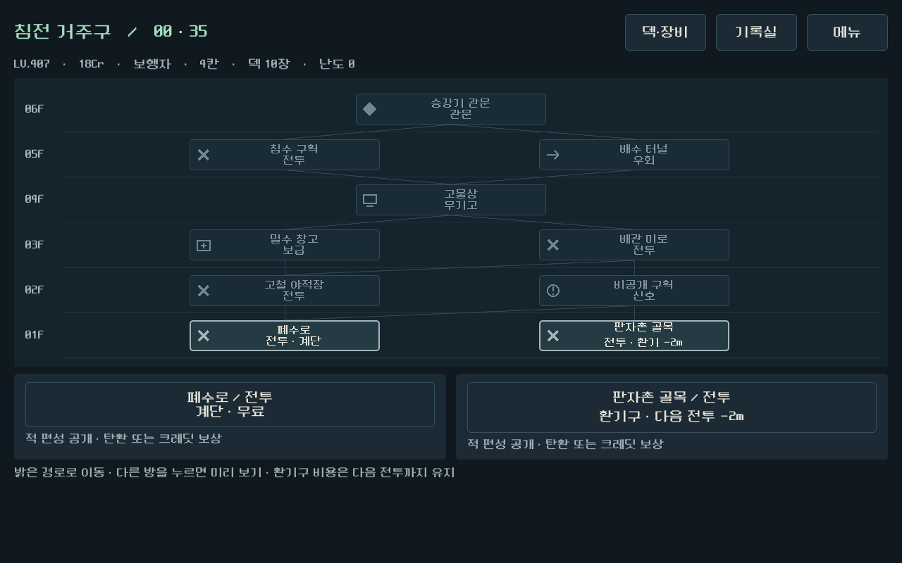
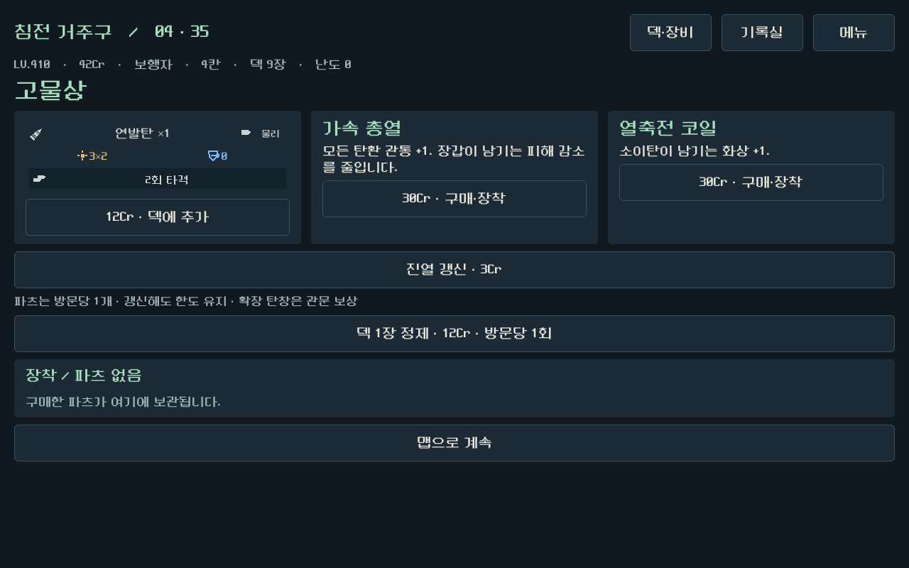
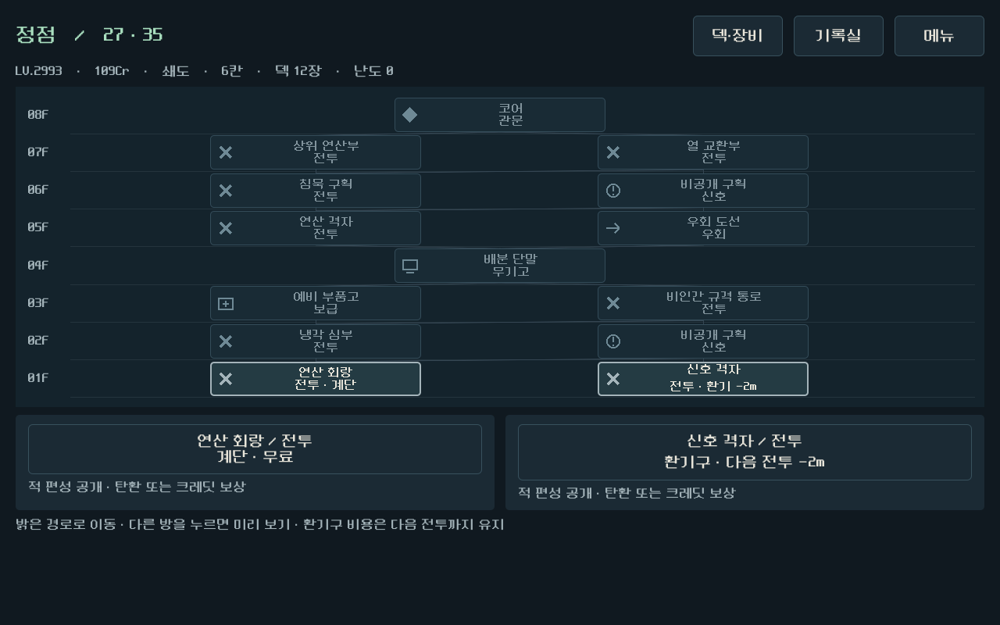
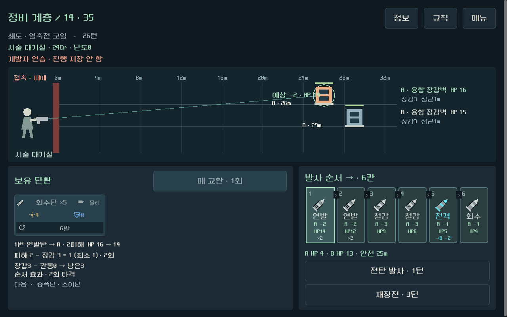

# 전체 도시 등반 QA

대상:`prototype/core-redesign`,Godot4.7,가로 화면. 전투의 좌→우 순서와 단순 피해/관통 규칙을 유지하면서5계층35층·맵·상점·이벤트·보급·관문·프로필을 연결했다.

## 검증 결과

| 검사 | 결과 | 범위 |
|---|---|---|
| 경제 조정 후 실제 명령 재생 | 28,743검사 / 실패0 / 10완주 | 시드731042·17,두 총기,일반/우회 경로,시드90210 난도10 |
| 정제·구매 빌드 신규 탐색과 재생 | 10,643검사 / 실패0 / 4완주 | 시드731042,두 총기,두 경로,유료 정제와 탄환 구매 |
| 실제 Godot UI 런 | 3,219검사 / 실패0 / 1,052버튼 / 2완주 | 두 총기35층,중간 저장 재개,기록실 해금,개발자 연습 저장 보존,작은 가로 화면 |
| 좁은 탄창 표시 마감 | 333검사 / 실패0 | 실제 명령으로 얻은6칸 상태,피해/HP의 정확성,글자 폭,액션 버튼,폰 가로 캡처 |
| 기존 탄환 규칙 | 11,877검사 / 실패0 | 결정론·손패·발사·화상·증폭·전이·교환·저장 |
| 기존7교전 실제 UI 회귀 | 1,610검사 / 실패0 / 4완주 / 485버튼 | 기초 훈련과기존단면,두 총기 |
| 기존 시각 회귀 | 174검사 / 실패0 | 손패·조합·상호작용·레이아웃 |
| 기존 제작본 전체 회귀 | 3,730통과 / 실패0 / 기존 경보3 | 기존 제작본 로직·UI·리소스 정합성 |

전체 UI 검증 후 마지막으로 칸별 그리기만 수정했다. 이후333검사로 실제6칸 상태의 표시를 확인했다. 최초 레이아웃 전용 실행이 기존 임시 UI 리포트 경로를 덮어써서, 전체 UI 수치는 성공한 프로세스 출력과 완주 캡처를 증거로 보존했다. 이후 레이아웃 전용 출력은`ui/layout`으로 분리했다.

## 전체 런 비교

| 성향 | 보행자 일반/우회 | 쇄도 일반/우회 | 결과 |
|---|---|---|---|
| 크레딧 선호·시드731042 | 221/136턴 | 125/74턴 | 4/4완주 |
| 크레딧 선호·시드17 | 200/132턴 | 126/74턴 | 4/4완주 |
| 난도10·시드90210 우회 | 126턴 | 78턴 | 2/2완주 |
| 정제·구매·시드731042 | 224/132턴 | 125/79턴 | 4/4완주 |

모든 런은35방을 방문하고6칸 탄창까지 성장했다. 일반 경로는25전투,이벤트·우회 경로는16전투로 목적지 선택이 실제 전투 길이를 바꾼다. 방문한 전투는 적 HP 강제 변경 없이 실제 장전·발사·재장전 명령으로 통과했다. 개발자 바로가기의 표시용 조우는 완주 증거로 사용하지 않았다.

배급 조정 전 크레딧 선호 잔액393~410Cr,조정 후161~265Cr,정제·구매 성향102~160Cr. 돈을 최대한 아끼는 정책은 여전히 잔액이 남으므로 경제의 최적 균형이나 돈의 체감 가치를 증명한 결과는 아니다. 정제 빌드가 항상 더 빠르거나 강한 것도 아니다.

## 중요한 불변 조건

- 저장마다 경로·프로필·지갑·상점 상태·전투 손패·덱·RNG를 다시 읽어 비교했다.
- 방문당 파츠1개,유료 정제1회 제한은 구매 후 재접속·리롤로 해제되지 않는다.
- 지갑 부족,잘못된 상품,덱 최소/최대,장착 파츠 분해,중복 보상/정산과잘못된 경로는 변경 없이 거부한다.
- 환기구 비용은 다음 전투에서 한 번만 소비한다. 영구 탄창 성장과 장착 파츠를 분리한다.
- 기록20개 중복 수집,시작 덱4성향,미리 보기의 RNG/상태 불변,실패 데이터 지급을 확인했다.
- 작은 창은논리1280×800을물리1008×630으로 축소하므로 논리 폭과 물리 경계를 각각 검사했다.
- CITY-01기록실 팝업 중복을 수정하고 재검증했다. 루트 인증서 저장소 오류는 기존 로컬 Godot 환경 출력으로 기능 실패와 구분한다.

## 증거와 재실행

[14런 요약](full_city_campaign_2026-09-16_assets/summary.json),[10런 실제 명령](full_city_campaign_2026-09-16_assets/city_campaign_report.json),[4개 신규 빌드](full_city_campaign_2026-09-16_assets/city_refined_campaign_report.json),[최종 레이아웃](full_city_campaign_2026-09-16_assets/city_layout_report.json).

```powershell
.\tools\run_city_checks.ps1 -Hard
.\tools\run_city_checks.ps1 -Seed 731042 -Refine -RunName refined
.\tools\run_city_checks.ps1 -Mode ui
.\tools\run_city_checks.ps1 -Mode ui -LayoutOnly
.\tools\export_windows_readability.ps1 -BuildKind city
```

UI 테스트는로컬 실행 결과가 없으면 보관된 실제 명령 파일을 사용한다.모든 QA와 Windows 런처는실제 사용자 저장과분리한 프로필에서 실행한다.






최종 아트·사운드,사람의 재미/호흡·선택 가치,실제 갤럭시 성능 확인은별도 확인이 필요하다. APK와원격푸시는 진행하지 않았다.

## Windows 플레이 파일

- 실행:`builds/city-windows/Play-City.cmd`
- 코드 커밋:`f075d3110ba28eddca932d72c4f107e175a435ce`
- 파일:`LastOnBoard-city.exe`,126,745,464바이트
- SHA-256:`8D2BF0F2CC4FD244B84B462461DA630FE3DFDA51537CBF1341F02B48B9214977`
- clean worktree 내보내기와격리 프로필 headless 기동 통과. 문서 갱신 커밋은게임 소스를 변경하지 않는다.
