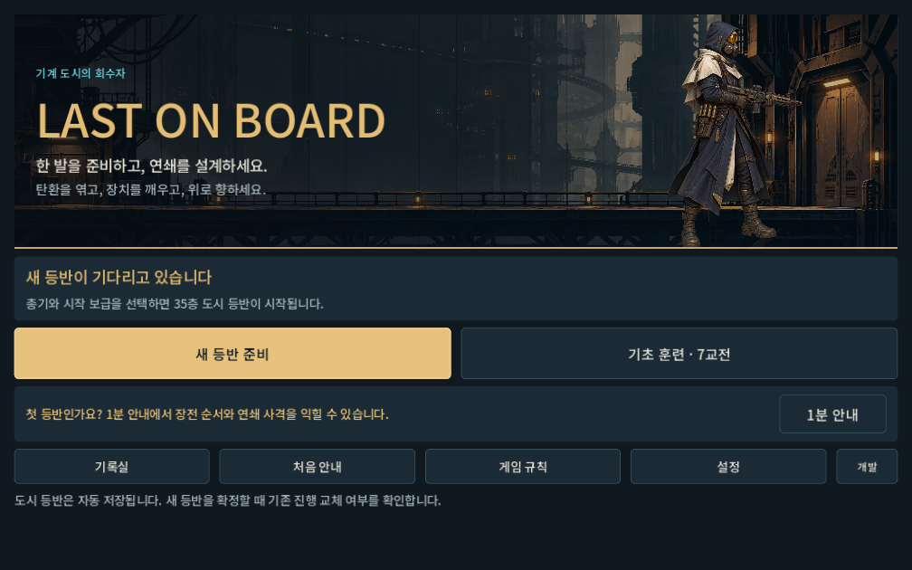
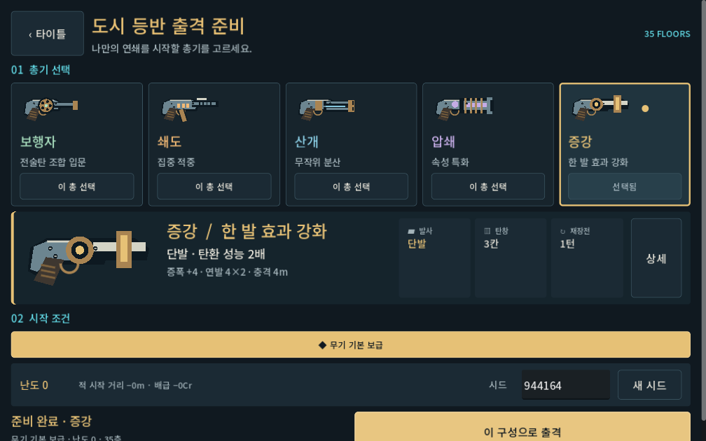
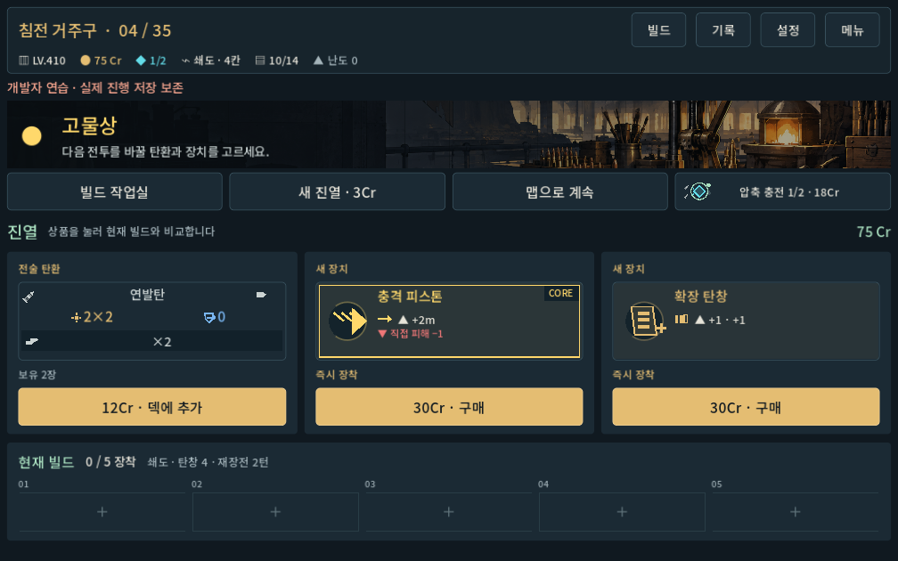
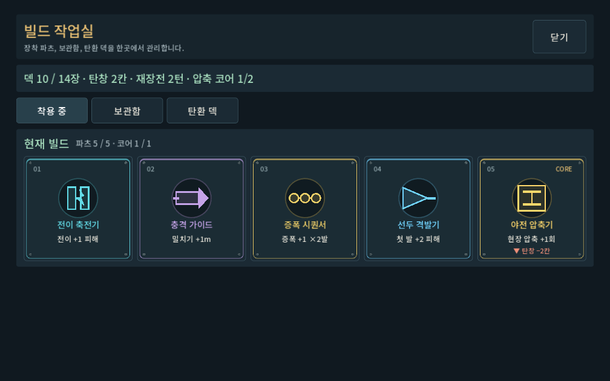
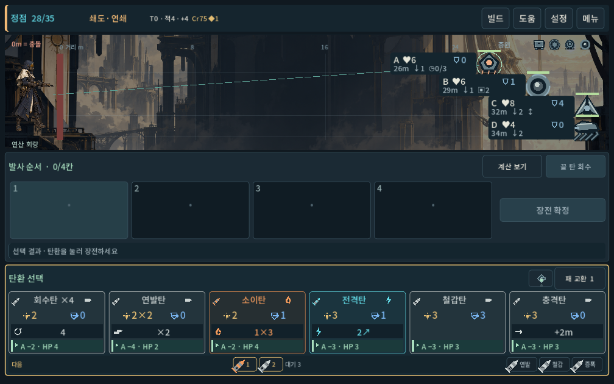
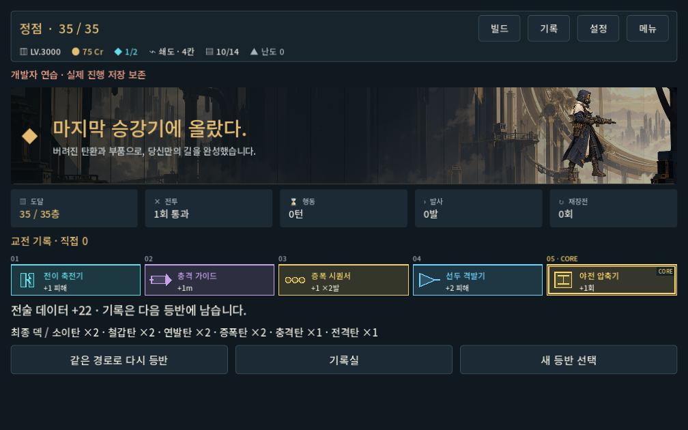

# 전체 플레이 경험 · 아트와 UI 적용 결과

2026-10-02 · `prototype/core-redesign` · Godot 4.7 stable · OpenGL Compatibility.

실행: 저장소 루트의 [PLAY.cmd](../../../PLAY.cmd). Godot에서 `새-게임-프로젝트/project.godot`을 열어 실행해도 같은 `redesign/main.tscn`을 사용한다. 기존 `ProjectLoB-QA.exe`는 이번 소스 변경을 포함한 새 빌드가 아니다.

## 적용한 작업

- 회수자, 작업실, 수직 도시 지도, 상층 네 구역의 원화를 제작했다. 첫 구역과 합쳐 다섯 구역의 실제 전투·화면 배너에 연결했다. 원본·프롬프트·해시는 [자산 목록](../../direction/art-assets.md)에 있다.
- 타이틀은 회수자와 도시로 구성하고, 출격 준비에서는 다섯 총기를 한 줄로 비교한다. 각 총기의 약실·총열·실루엣과 선택된 무기의 큰 그림을 새로 그렸다.
- 지도는 도시 위 경로와 오른쪽 목적지 패널로 구성했다. 상점은 상품 세 개, 구매 버튼, 압축 충전, 장착 상태를 한 화면에 모았다. 비교는 선택할 때 열리고 구매 버튼까지 화면 안으로 이동한다.
- 빌드 작업실은 다섯 장착 파츠를 나란히 보여준다. 각 장치의 기호, 이름, 이득, 패널티를 분리하고 눌러 상세 규칙을 확인한다.
- 전투는 구역별 배경과 회수자, 역할별 기계 적을 사용한다. 화염·전기·물리 타격 파편과 이동 관절 표현을 추가했다. 발사한 탄환은 원래 칸에 표시되어 순서가 당겨지지 않는다. 실제 피해와 발동한 파츠가 발사 레일에 나타난다.
- 도시 기록 20개와 완료 문구를 현재 회수자 설정으로 정리했다. 한글은 Noto Sans KR을 프로젝트에 포함하고 향후 내보내기에 OFL 원문을 포함하도록 설정했다.

## 발견하고 수정한 문제

| 문제 | 수정 및 확인 |
| --- | --- |
| 미구매 파츠를 소유권 기준으로 검사해 자동 장착도 보관함 이동으로 안내 | 구매 후 파츠 구성을 검증한다. 구매 예측과 실제 장착, 코어·슬롯 제한, 구매 후 장착 상태까지 검사했다. |
| 탄환 비교의 현재 성능에 기본 수치를 표시 | 실제 총기·파츠가 반영된 피해와 관통 함수를 사용한다. |
| 비교 설명과 압축 카드가 상품·빌드를 아래로 밀어냄 | 압축 충전을 상단 조작부로 옮기고 상품 카드 자체를 비교 입력으로 사용한다. 기본 상점은 1008×630에서 세로 스크롤이 없다. |
| 새 한글 글꼴의 행 높이로 전투가 약간 넘침 | 발사 레일 여백과 높이를 조정했다. 세 화면 비율과 6장 손패·압축 상황에서 재검증했다. |
| 발사 시 탄환이 앞으로 당겨져 처음 설계한 순서가 흐려짐 | 원래 슬롯을 유지하고 발사한 칸을 표시한다. 연출 후 적 상태가 모델 결과와 정확히 일치하는지도 확인했다. |

## 검증 결과

사용자 저장과 분리된 `qa_runtime`에서 실행했다. 숫자는 기능 검사 결과이며 사람의 재미·이해도 점수가 아니다.

| 검사 | 결과 |
| --- | --- |
| 무기·탄환·파츠 규칙 | 3,245개, 실패 0 |
| 다섯 무기 UI·입력·저장 보호 | 390개, 실패 0 |
| 전체 캠페인 UI | 3,698개, 실패 0 · 입력 1,186회 |
| 타이틀·출격 준비 | 33개, 실패 0 |
| 새 자산·상점·다섯 파츠·연출 | 64개, 실패 0 |
| 1280×800 / 1008×630 / 1440×630 전투 배치 | 실패 0 |
| 압쇄·증강의 새 캠페인 탐색 | 10,668개, 실패 0 |
| 현재 규칙 35층 완주 경로 | 다섯 총기 × 두 경로 = 10회, 실제 명령 4,596개 |

완주 경로의 시드는 `731042`, 난도는 0이다. 보행자·쇄도·산개는 확장 탐색에서 여섯 경로를 완료했고, 압쇄·증강은 별도 탐색 네 경로를 완료했다. 처음 시작한 20개 확장 탐색은 이 범위의 검증이 확보된 후 중단했으며, 나머지 미완료 항목은 통과로 세지 않았다. 탐색기는 미래 패·RNG를 읽는 기능 QA이므로 공정한 승률·재미 평가로 사용하지 않는다.

과거 `campaign_preart_hard10` 재생은 5건 실패했다. 보행자·쇄도·산개·압쇄는 302번 방의 전투 종료 시점, 증강은 101번 방의 종료 시점이 현재와 달랐다. 해당 기록은 이번 통과 근거에서 제외했다. 새 탐색을 위해 게임 수치를 수정하지 않았다.

구조화된 결과와 실행 로그: [verification.json](full_experience_2026-10-02_assets/verification.json). 환경의 인증서 저장소 경고와 수정 과정의 파서·배치 실패는 최종 성공과 구분했다. 변경 후 최종 UI 실행에는 스크립트 오류가 없었다.

## 실제 화면

## 남은 검수와 제작 경계

실제 갤럭시에서 글자·터치·프레임·긴 플레이 피로도는 새로 검수하지 않았다. APK를 만들지 않았다. 플레이어는 단일 원화와 반동 표현이고 적은 엔진 기하 도형과 관절 표현이다. 전용 보스 원화·캐릭터 프레임 애니메이션·음악·효과음은 이번에 제작한 범위에 포함되지 않는다. 이 상태는 전체 흐름을 실제로 플레이할 수 있는 아트·UX 적용본이며, 상용 출시 품질이나 다른 게임보다 높은 품질을 검증했다는 뜻은 아니다.
