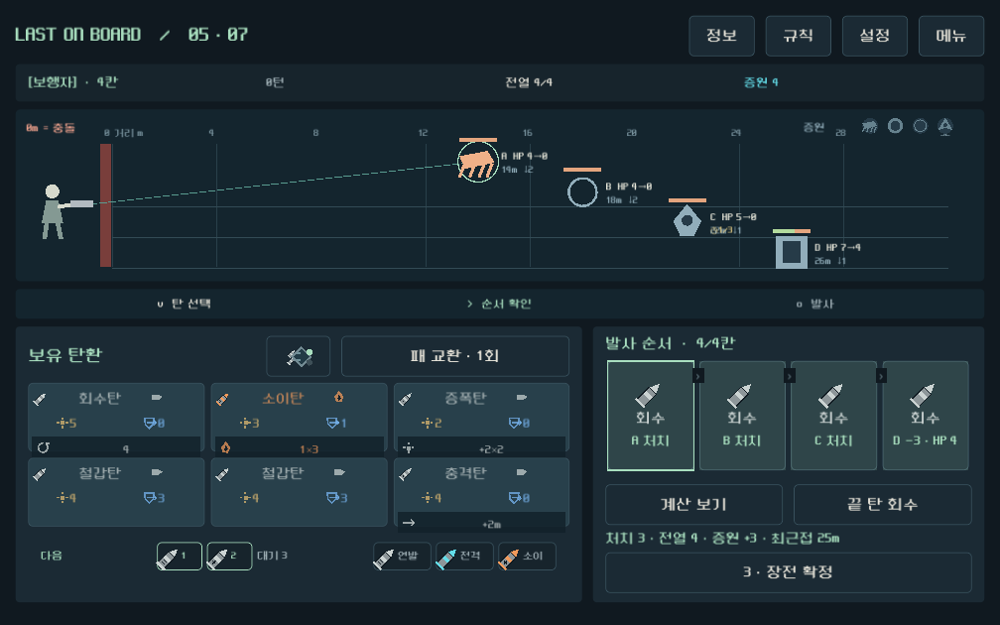
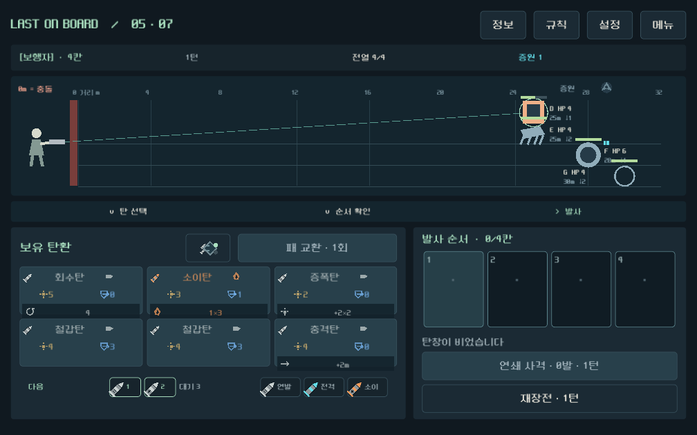
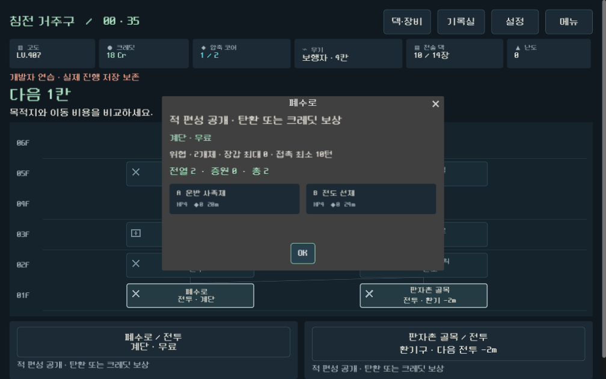

# 저체력 다수전·증원·전투 UI QA

검증일: 2026-09-21  
브랜치: `prototype/core-redesign`  
결론: **기능 및 자동 UI 검증 통과**

## 기능 결과

| 범위 | 결과 |
|---|---:|
| 전체 현대 회귀 | 3,730 통과 / 0 실패 / 기존 경고 3 |
| 다수전·증원 전용 | 142 / 0 |
| 전용 실제 UI | 20 / 0 |
| 적 기믹 | 27 / 0 |
| 다섯 무기 규칙 | 3,192 / 0 |
| 현장 압축 밸런스 | 264 / 0 |

전용 검증은 전열 최대 4기, 총 8기 상한, 2기 이하 자동 보충, 배치 턴 이동 면제, 대기열 포함 승리 조건, 저장 v7, 증강 처형 연쇄, 예측과 실제 결과 일치를 검사한다.

## 35층 대표 완주

시드 `731042`, 난도 0에서 안전/혼합 두 경로를 검사했다.

| 무기 | 안전 경로 | 혼합 경로 | 교전당 평균 턴 범위 |
|---|---|---|---:|
| 보행자 | 완주 | 완주 | 대표 로그 포함 |
| 쇄도 | 완주 | 완주 | 4.48~5.19 |
| 산개 | 완주 | 완주 | 4.72~5.50 |
| 압쇄 | 완주 | 완주 | 4.12~4.31 |
| 증강 | 완주 | 완주 | 5.92~6.00 |

보행자는 안전 538명령, 혼합 366명령으로 두 경로를 완주했고 총 5,637개 검사를 통과했다. 무기별 턴 수 차이는 남지만 어느 무기도 증원 구조 때문에 막히지 않았다.

## 휴대폰 비율 캡처

계획 화면: 4기 전열과 공개 증원, 탄환 후보, 발사 순서, 예측, 행동 버튼이 같은 화면에서 판독된다.

증원 후 화면: 행동 종료 후 전열이 다시 4기로 보충되고 대기 수량이 줄어든다. 새로 온 적은 해당 행동에서 접근하지 않는다.

지도 미리보기: 노드 상세에서 전열, 증원, 총 수량과 증원 순서를 전투 진입 전에 확인한다.

## 판단과 남은 확인

전투 길이는 기존의 짧은 1~3기 교전보다 4~6턴대로 늘었고, 한 탄창 안에서 처치·표적 전환·다음 전열 준비가 반복된다. 구조적으로 사용자가 제안한 “앞의 2~3마리를 잡으면 뒤에서 더 등장”하는 흐름을 충족한다.

최종 재미 판단은 실제 휴대폰 플레이가 필요하다. 특히 6~8기 교전의 반복 피로, 증강의 평균 턴, 후반 화상·전이 빌드의 전열 삭제 속도를 다음 플레이테스트에서 확인한다. 이번 작업에는 APK 제작을 포함하지 않았다.
