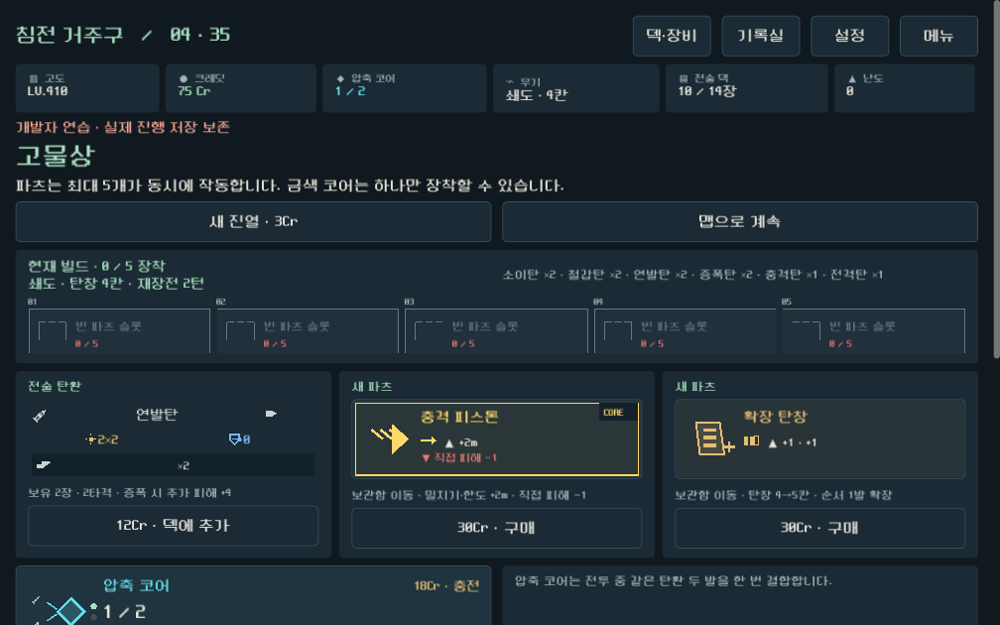
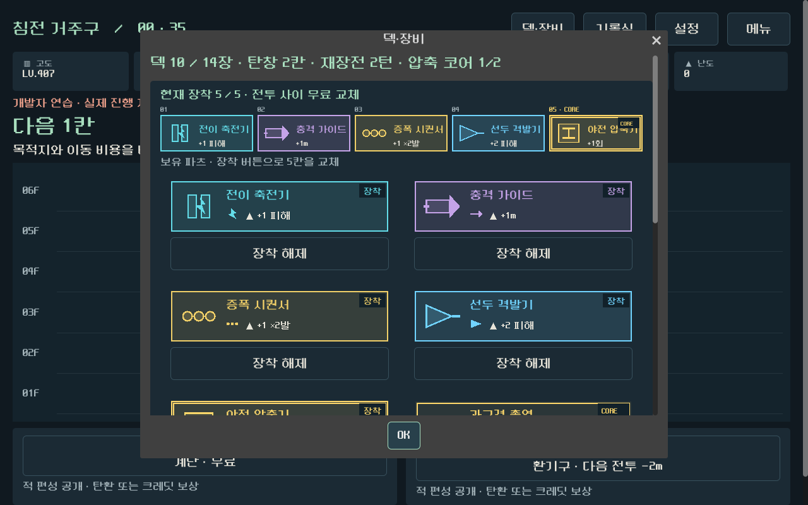
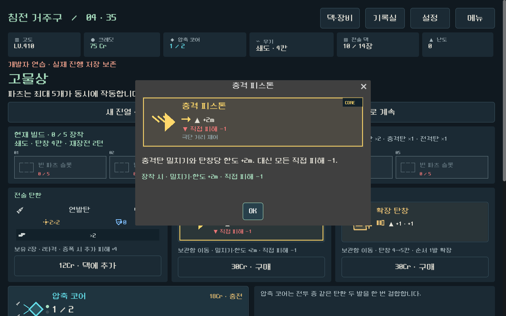
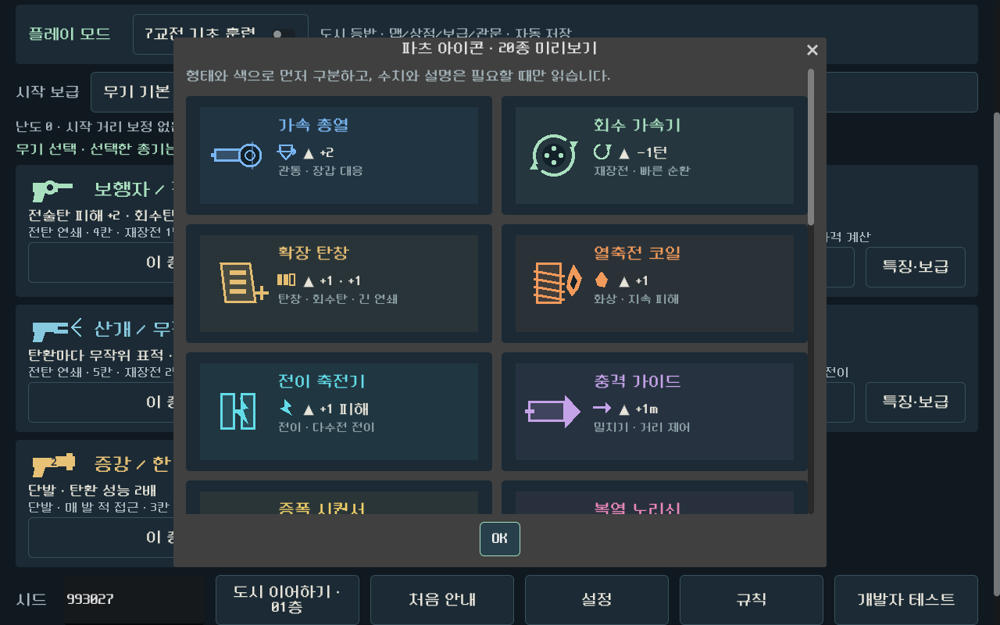

# 5칸 파츠 빌드 QA 보고서

검증일: 2026-09-21  
대상 브랜치: `prototype/core-redesign`  
화면 기준: 1280×800, 1008×630

## 판정

**기능·저장·실제 UI 검증 통과.** 파츠 5개가 동시에 적용되고 코어 2개는 거부된다. 상점과 장비창은 모바일 가로 화면에서 가로 스크롤 없이 조작할 수 있다.

## 결과

| 검사 | 범위 | 결과 |
|---|---|---:|
| 무기 규칙 | 20종 파츠, 5중 효과, 코어 제한, 순서 조건 | 3,245 / 0 실패 |
| 다수전 규칙 | 증원과 고정 레인 회귀 | 144 / 0 실패 |
| 가독성 정산 | 예측·저장 변환·탄환 설명 회귀 | 30,068 / 0 실패 |
| 캠페인 | 2시드 × 2무기 × 안전/혼합 35층 | 22,631 / 0 실패, 8/8 완주 |
| 실제 UI | 두 무기 완주, 상점·구매·장착·코어 교체 | 3,426 / 0 실패 |
| 실제 입력 | 클릭·선택·구매·교체·진행 | 1,103 입력 |

저장 경계와 전투 중 교체 잠금 보강 뒤 최종 단일 시드 35층 2경로 4,743/0, 실제 UI 1,613/0·507입력을 별도로 재실행했다.

## 저장과 자원 검증

- 5개 장착 상태를 캠페인과 전투 저장에서 정확히 복원한다.
- 여섯 번째 파츠와 두 번째 코어 장착을 거부한다.
- 이전 단일 파츠 저장을 다중 장착 형식으로 변환한다.
- 야전 압축기의 교전 무료 1회가 상점에서 충전한 압축 기회보다 먼저 소모된다.
- 장착 교체 뒤 탄창, 회수탄, 밀치기 한도와 재장전 값을 함께 다시 계산한다.

## 시각 확인

### 모바일 상점

### 덱·장비

### 파츠 상세와 전체 아이콘

## 장기 캠페인 표본

8회 모두 35층을 완주했다. 최종 장착에는 다음과 같은 서로 다른 조합이 포함됐다.

- 보행자: 열축전 코일, 과구경 총열, 선두 격발기, 증폭 시퀀서, 확장 탄창
- 쇄도: 충격 피스톤, 열축전 코일, 예비 급탄기, 후미 점화기, 선두 격발기
- 보행자: 야전 압축기, 충격 가이드, 가속 총열, 열축전 코일, 후미 점화기
- 쇄도: 야전 압축기, 가속 총열, 충격 가이드, 회수 가속기, 복열 노리쇠

자동 완주는 특정 조합의 재미나 완벽한 밸런스를 증명하지 않는다. 실제 플레이에서는 코어 패널티가 선택을 바꾸는지, 일반 모듈 다섯 개만 쌓는 전략과 코어 한 개를 섞는 전략이 모두 유효한지 확인한다.
