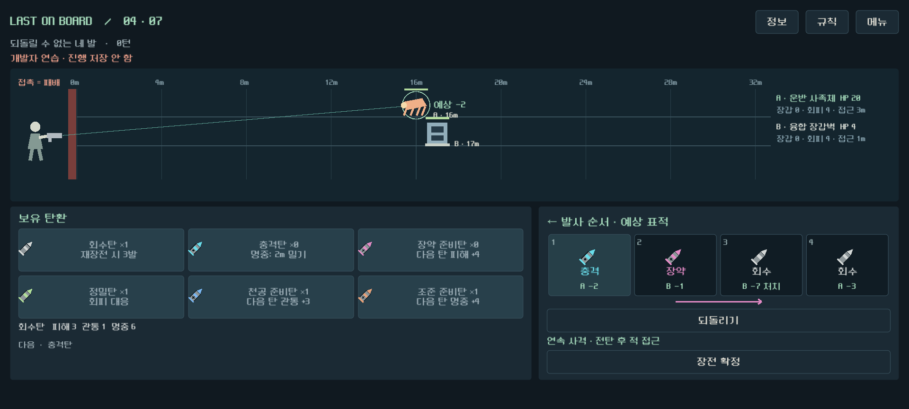

# 갤럭시용 테스트 APK — 2026-09-12

다수전 표적 예고 버전(8828839)을 갤럭시에 직접 설치할 수 있는 테스트 서명 APK로 내보냈다.

## 파일과 설치

`D:/ProjectLoB/worktrees/core-redesign/builds/android-test/LastOnBoard-test.apk`

앱 이름 **Last on Board Test**, 패키지 `com.lastonboard.prototype`, 버전 `0.1.20260912` / 코드20260912. ARM64/ARMv7, 최소 API24(Android7), 대상 API36. 가로 회전과 OpenGL ES3 호환 렌더러 사용. [설치 안내](android_install_2026-09-12.md).

파일 크기 81383442바이트(약81MB), SHA256 `5244916464F6AF2BD30D4426E290BEE971B63CFFDF755B41AAF3075CF3C5354A`.

## 구현과 검증

- 설치된 Godot4.7 Android 템플릿/JDK17/SDK를 사용한다. `tools/export_android_test.ps1`은 임시 프리셋을 복원하고 격리된 에디터 설정을 사용한다. 기존 사용자 설정과 Windows 빌드는 보존한다.
- 모바일 렌더러 기본값이 Vulkan 기반 Mobile로 적용되던 것을 `renderer/rendering_method.mobile="gl_compatibility"`로 명시했다. 첫 APK의 추가 Vulkan feature 속성이 기존 aapt 검사에서 타입 오류를 유발했고, 설정 보정 후 Vulkan 항목 없이 검증을 통과했다. 실제 기기의 설치 오류로 재현한 것은 아니다(AND-01).
- apksigner v2/v3 서명 검증 통과, zipalign 4바이트/16KiB shared library 정렬 확인, aapt 패키지/ABI/최소OS/가로 방향/GL ES3 확인. ZIP CRC와 redesign 메인/예고 리소스 포함, 테스트 리소스 제외 확인.
- PC에서 `InputEventScreenTouch`를 넣어 시작/정보/장전/취소/확정/단발/보상/저장 재개/다수 적 상세/일제34검사 통과. 시뮬레이터 초기 좌표 배율과 JSON 숫자형 비교 오류를 보정했으며 게임 입력 코드는 변경하지 않았다.
- 연결된 Android 기기와 설치된 AVD가 없어 실제 Android 실행·성능·발열·물리 터치 체감은 미검증이다. PC 검사를 APK 실행 검사로 취급하지 않는다.

증거: [APK 검증 메타데이터](qa/reports/android_package_2026-09-12.json), [터치 검사](qa/reports/android_touch_2026-09-12.json). 서명/정렬/패키지 원본 로그는 `builds/android-test`에 보관한다.

이전 다수전/전체 캠페인 검사 수치를 이번 Android 실행 결과로 재사용하지 않는다. 전투 모델/게임 규칙/화면 배치 변경은 없으며 재설계 브랜치에서만 작업했다.

## 기술 참조

[Godot Android 내보내기](https://docs.godotengine.org/en/stable/tutorials/export/exporting_for_android.html), [4.7 Android exporter](https://github.com/godotengine/godot/blob/4.7-stable/platform/android/export/export_plugin.cpp). 엔진의 모바일 렌더러 오버라이드와 템플릿 APK 내보내기 경로를 확인했다.
