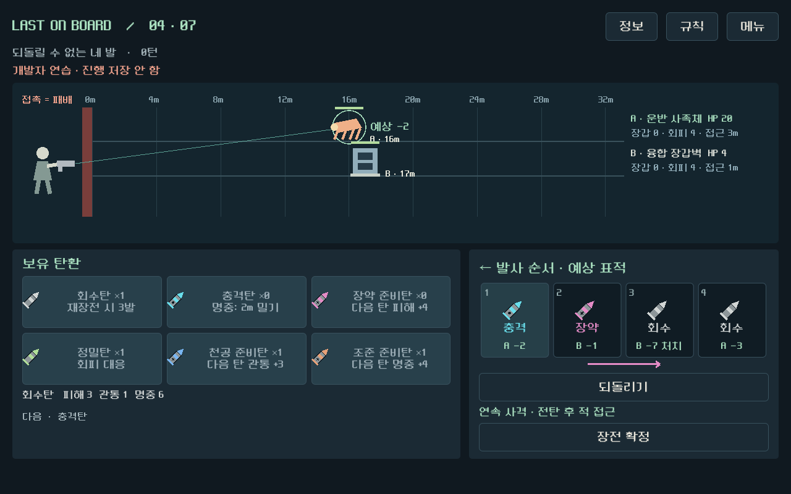
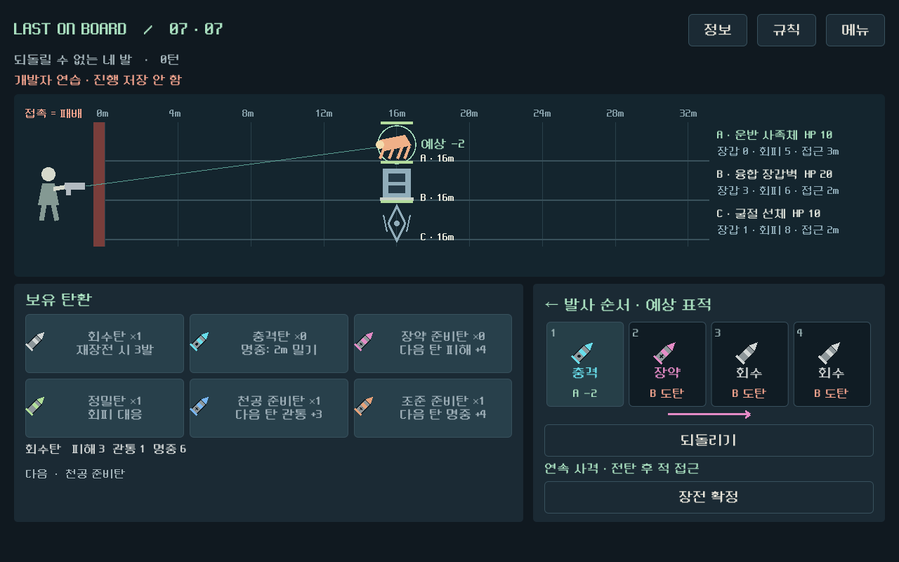

# 다수 적 표적 예고 — 2026-09-12

다수 적 전투에서 탄환별 표적 변화와 결과를 발사 전에 확인할 수 있다. 기존 Godot 그래픽/간결한 UI와 전투 규칙을 유지한다.

## 실행과 확인

`D:/ProjectLoB/worktrees/core-redesign/builds/multi-windows/Play-Multi.cmd`

메뉴 → 개발자 테스트 → **다수전 표적 전환 연습**으로 들어가면 충격탄으로 A를 밀고 B를 처치한 뒤 A로 돌아오는 탄창을 바로 확인할 수 있다. 연습은 일반 저장을 변경하지 않는다. 새 빌드의 저장은 같은 폴더의 `qa-profile`에 격리하며 이전 빌드는 보존했다.

## 표시와 규칙

- 전장과 탄창에 동일한 A/B/C 표적 식별자를 표시한다. 가까운 적을 자동 조준하며 같은 거리에서는 A, B, C 순서다.
- 탄창 각 칸 아래에 표적과 피해·도탄·빗나감·처치를 표시한다. 전투 종료로 쏘지 않는 잔탄은 `보존`, 접촉 패배로 쏘지 못하는 탄은 `중단`이다.
- 예고는 **현재 탄창을 중간 재장전 없이 연속 발사**하는 조건이다. 단발은 매 발 사이의 적 이동과 둔화 소모까지, 일제는 탄마다 재표적하고 전탄 발사 뒤 한 번 이동하는 것을 반영한다.
- 적 몸체 클릭, 오른쪽 적 정보 버튼의 클릭/키보드 Enter로 개별 상세 정보를 연다. 포인터를 올리면 툴팁과 테두리를 표시한다. 정보 확인은 실제 조준 대상을 바꾸지 않는다.
- 같은 거리에서도 적을 서로 다른 줄에 표시한다. 거리 글자는 적 옆에 배치해 아래 적 몸체와 겹치지 않도록 했다. 실제 거리는 바꾸지 않는다.
- 연출 중에는 예고를 지우고 실제 순차 사격 결과를 보여준다. 장전/취소/확정/발사 후 예고를 갱신한다.

## 구현

`redesign/forecast.gd`가 모델을 깊게 복제하고 실제 `confirm/fire` 명령으로 최대 4발을 계산한다. 화면용 수식을 별도로 만들지 않는다. `battle_view.gd`의 개별 적 확인, `magazine_view.gd`의 탄별 예고, `screen.gd`의 갱신/상세/연습 진입을 연동했다.

기존 `model.gd` SHA256은 `ACFD2C4183E437B5A4C761A6672FF74EC298B906A1262F6C8EFE77F0D5E0C789`로 변경 없다.

## 검증

| 검사 | 결과와 범위 |
|---|---|
| 다수전 집중 | 129 통과 / 0 실패. 예고/실제 명령 대조, 실제 포인터·키보드 개별 정보, 예고 갱신, 동일 거리 세 적과 작은 창 |
| 독립 정합 | 2,627 / 0. 대표18 + 조합256 = 274상태, 원본/RNG/저장 불변, 단발·일제·준비·중단·잔탄 |
| 기본 화면 | 49 / 0 |
| 기존 연출 | 39 / 0 |
| 전체 UI | 493 / 0. 두 총기 각7교전, 214버튼 행동, 저장/이어 하기 |

최종 처치 문구 수정 후 다수전129와 독립2627을 재검증했다. 기본 화면/연출/캠페인 검사는 그 직전 계산과 입력 동작이 동일한 후보에서 통과했다. 자동 실행은 사람의 재미·가독성 측정을 대체하지 않는다.

집중 테스트의 첫 실행은 둔화 후 두 적이 7m로 같아지는 사례를 B 표적으로 잘못 기대해 1건 실패했다. 동률 A 우선으로 테스트 기대값만 바로잡았다. 제품의 계산 변경은 없었다. 독립 검사의 합성 저장 fixture 보정 내역은 해당 원본 보고서에 기록했다.

원본 증거: [집중 검사](qa/reports/multi_target_checks_2026-09-12.json), [전체 UI](qa/reports/multi_target_campaign_2026-09-12.json), [독립 정합 감사](qa/reports/multi_target_consistency_2026-09-12.md), [독립 화면 검토와 최종 부록](qa/reports/multi_target_experience_2026-09-12.md).

거리 라벨과 아래 적 몸체의 중첩을 VIS-02로 기록해 수정했다. 최종 화면 검토는 정지 화면이며, 실제 사람의 예측 이해도와 전투 호흡 확인은 다음 단계다. 이번 변경은 최대3적/4발인 현재 후보 범위이며 임의의 다수 적 편성으로 확장한 것은 아니다.

Windows 빌드는 `tools/export_windows_multi.ps1`로 재생성한다. 대상은 `prototype/core-redesign`이며 main과 기존 빌드/개인 설정은 보존한다.

최종 실행 파일 126669648바이트, SHA256 `B783319759832DEFF0575A38B6388EB541A471F1776A550D14E03664E3E5A09F`. 내장 PCK 내보내기와 headless 시작 검사 통과.
