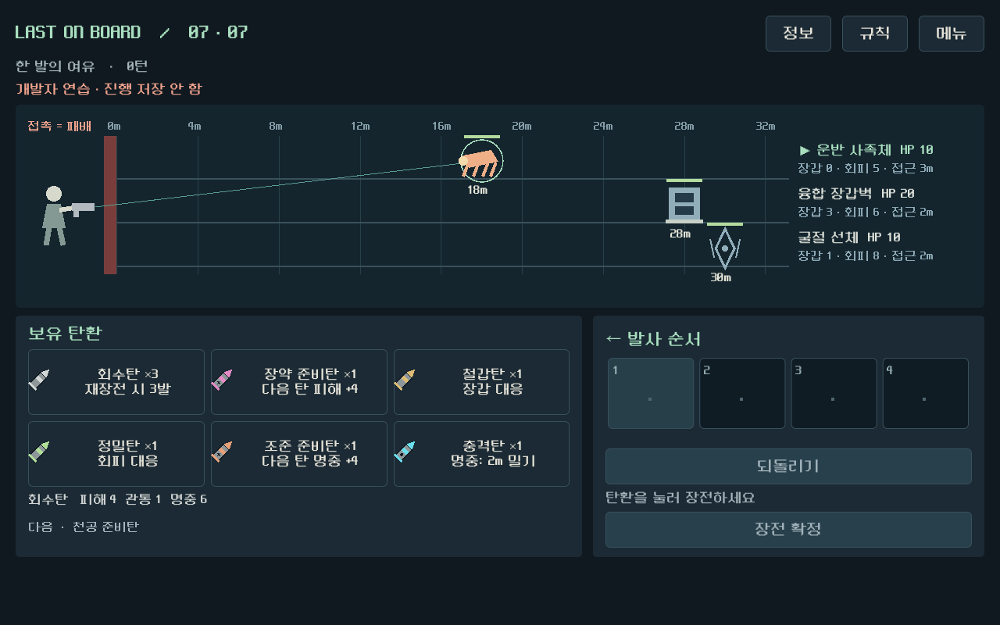
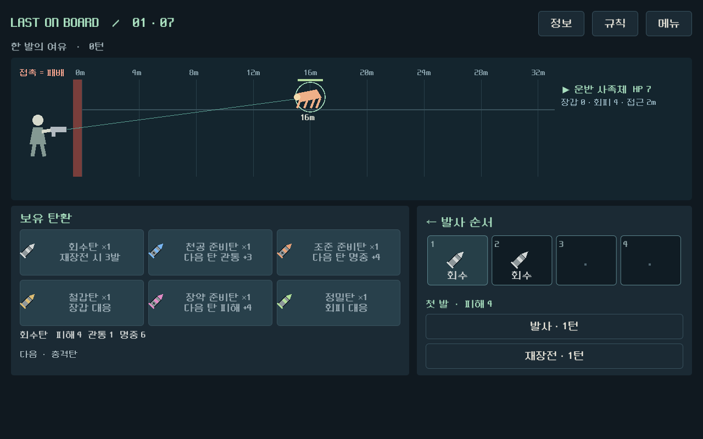

# 전투 화면 텍스트 정리 — 2026-09-12

사용자가 긍정적으로 평가한 Godot 그래픽과 시각 전투를 유지하면서, 상시 표시되는 설명과 수치의 반복을 줄였다.

실행: `D:/ProjectLoB/worktrees/core-redesign/builds/quiet-windows/Play-Quiet.cmd`. 이전 `visual-windows` 빌드를 보존했고, 새 런처는 자신의 `qa-profile`에 저장한다.

## 화면 변화

- 탄환 카드는 아이콘·이름·수량·한 줄 역할로 정리했다. 마우스를 올리거나 키보드 포커스를 주면 공용 정보줄에 현재 총기/파츠가 반영된 피해·관통·명중을 표시한다. 전체 툴팁도 유지한다.
- 전장에는 적 이름·현재 HP·장갑·회피·다음 접근 거리와 거리 축을 남겼다. 최대 HP와 기본 속도는 정보 창에서 확인한다.
- 시드·조우 설명·전체 덱·최근 결과·장비 설명은 상단 `정보` 버튼으로 연다. 마우스 호버 없이도 전체 탄환 수치를 확인할 수 있다.
- 탄창은 발사 순서와 첫 발의 결과를 중심으로 표시한다. 중복 안내/바닥 로그를 제거하고, 연출 생략은 재생 중에만 노출한다. 발사/재장전 턴과 접촉 위험 안내는 유지한다.
- 메뉴의 중복 소개와 보상 화면의 기본/현재 스탯 중복, 전체 덱 나열을 줄였다. 보상·정제 선택과 개발자 테스트 바로가기를 유지한다.

## 확인한 범위

| 검사 | 결과 |
|---|---|
| 화면·입력 경로 | 49 통과 / 0 실패 |
| 연출/중복 입력/생략/모델 정합 | 39 / 0 |
| 두 총기 7교전 UI 경로 | 493 / 0, 214버튼 행동, 저장/이어 하기 포함 |
| Windows 내보내기 | 내장 PCK 생성 및 실행 파일 headless 시작 통과 |

화면 검사는 키보드 포커스의 탄환 수치 표시와 클릭 가능한 정보 창 열기/닫기가 전투 상태를 바꾸지 않는 것도 확인했다. 자동화는 실제 씬의 버튼 신호와 프레임을 사용하며 사람 플레이를 대체하지 않는다. [화면 검사](qa/reports/quiet_ui_visual_2026-09-12.json), [연출 검사](qa/reports/quiet_ui_motion_2026-09-12.json), [전체 UI 기록](qa/reports/quiet_ui_campaign_2026-09-12.json), [독립 화면 검토](qa/reports/quiet_ui_experience_2026-09-12.md).

규칙 모델은 변경하지 않았다. SHA256: `ACFD2C4183E437B5A4C761A6672FF74EC298B906A1262F6C8EFE77F0D5E0C789`. 이번 작업에서 규칙48/독립100/기존 전체3730 검사를 재실행한 것으로 집계하지 않는다.

Windows 빌드는 `tools/export_windows_quiet.ps1`로 생성한다. 빌드 해시와 시작 검사 결과는 `builds/quiet-windows/build_manifest.json`에 기록한다. 기존 main의 개인 설정은 변경하지 않으며, 작업 범위는 `prototype/core-redesign`이다.

실행 파일은 126662912바이트이며 SHA256은 `F334BC73B51D7CF8CC6D297C401DABAE6FB5FB1EF91B26A742EBD4D2694F3BE7`이다.

## 다음 확인

독립 정지 화면 검토에서 정보 그룹 구분이 선명해지고 새 명백한 겹침/잘림은 발견되지 않았다. 실제 사람에게도 수치 확인 위치가 자연스럽게 발견되는지, 탄환 비교에 번거로움이 생기는지는 다음 플레이에서 확인한다. 이번 긍정적 그래픽 피드백을 전체 밸런스·재미 승인으로 확대하지 않는다.
