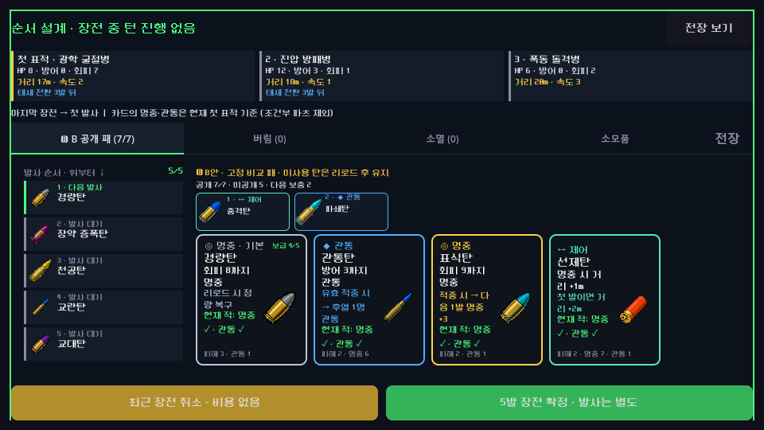
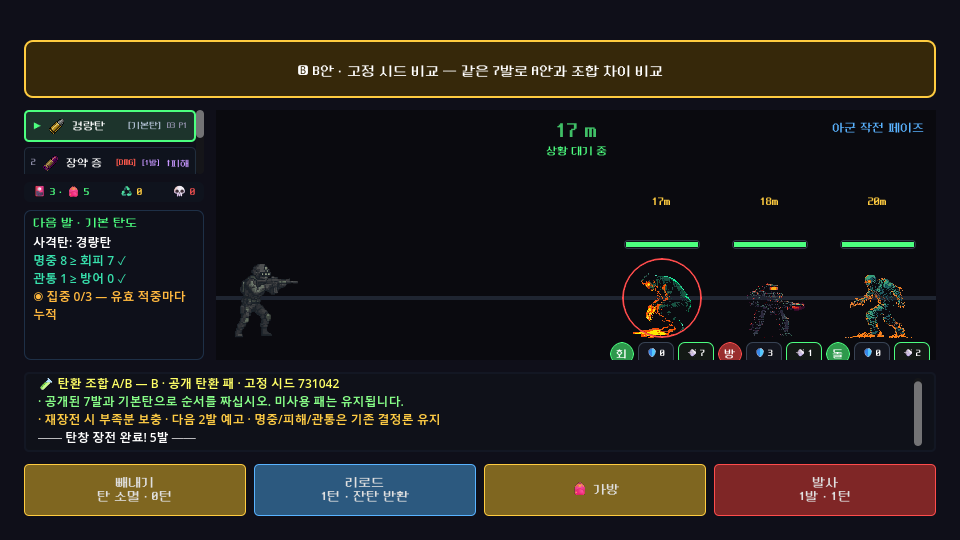

# 전술 장전 작업대 · 실제 전투 정합 개선

사용자가 UI 레이아웃 변경까지 위임한 범위에서, 적 정보와 장전 순서를 동시에 읽는 화면을 구현했다. 기준은 3a116ad이며 최종 아트·오디오 제작은 이번 범위에 포함하지 않는다.

## 바뀐 플레이 흐름





- 교전 시작과 리로드 완료 후 전술 작업대가 자동으로 열린다. 랜덤 패 B안은 공개 연출이 끝난 다음 열린다.
- 상단에 실제 첫 표적과 나머지 대열의 HP·방어·회피·거리·속도·차징/방벽/태세 정보를 보여준다. 적의 미래 정보를 추가 공개하거나 타겟을 바꾸지 않는다.
- 후보 탄과 발사 순서를 나란히 배치했다. 마지막에 넣은 탄이 첫 번째 행에 오고, 기본5발 전체가 함께 보인다. 긴 탄창과 후보 목록은 각각 스크롤하며 확정·취소 버튼은 고정한다.
- 장전 취소의 무료 비용과 장전 확정/실제 발사를 구분한다. 교전 중 추가 장전은 닫을 때 적이 한 번 행동한다는 비용을 표시한다.
- 전장 왼쪽에 다음 발 탄도 분석을 분리하고 발사·연발·리로드·빼내기의 비용을 버튼에 표시했다. 인접 거리의 적도 배지 간격을 확보하고 각 적의 논리 거리를 숫자로 표시한다.
- 장전 안내를 줄이고 LIFO 제목과 실제 행동 비용을 바로잡았다. 개발자 메뉴에 전술 작업대 QA를 추가했다.

## 발견한 게임 결함

**#025 적 기준 스탯 불일치:** 기존 UI는 적 리소스를 복제해 거리 보정을 적용했으나, 복제본의 resource_path가 사라져 EnemyInstance의 CSV 조회가 누락됐다. 돌격병은 정본 HP6·거리10 대신 HP8·거리8로 등장했다. EnemyData.for_encounter가 원본 CSV를 복제본에 반영하고 그 다음 조우 거리 비용을 적용한다. 공유 원본과 합성 QA 적은 보존한다.

**#026 닫기 경로별 추가 장전 비용 누락:** 기존 가방의 상단 닫기와 소모품 후 닫기는 패널만 숨겨 전진 비용 정산을 우회했다. 모든 사용자 닫기 경로를 CombatOverlayV2._toggle_drawer로 통일했다. 중복 닫기는 다시 과금하지 않는다.

## 검증

- 전체 회귀 **3,730 통과 / 0실패 / 기존 경보3**. CSV 기준 조우 준비·거리 비용·원본 보존 회귀40개를 추가했다.
- 최종 프레임 진행 UI 검사 **54개 / 실패0**. 실제 viewport 입력으로 카드 선택, 무료취소 수량 반환, LIFO 확정, 별도1발 발사, 추가 장전 후 세 닫기 경로의 전진/중복과금 방지, 리로드 자동복귀,6발 탄창/B안, 화면 경계와 인접거리 간격, 흡수형 방벽 표시를 확인했다.
- 실제 렌더12화면: 비어 있는 작업대·5발을 채운 작업대·격발 전후·4체/동거리·흡수형 방벽·도움말·로어·960×540/1280×720 출력. 큰 출력도 게임의960×540 논리 화면을 스케일하므로 더 넓은 독립 레이아웃 검증으로 해석하지 않는다.
- 독립 후반 검사10사례×193후보 및 선정 해법 재실행. CSV 수정 전9사례, 수정 후10사례에서 승리 순서를 확보했다. E관문 승천10은17발·리로드3턴·긴급 격퇴 사용으로 처치했다. **지정 덱/파츠의 유한 해법 증거이며 실제 캠페인 승률이 아니다.**
- CSV 수정 후 기존 공개 정책731042-experimental은1교전·27행동에서 종료했다. 정책의 조합/재계획 한계와 새 적 조건이 있으므로 이전 봇 기록과 승률을 단순 비교하지 않는다.
- Windows 내보내기와 헤드리스 기동 결과 및 최종 SHA256은 [검증 명세](qa/reports/tactical_workbench_validation_2026-09-11.json)에 보존한다. 이 환경의 루트 인증서 저장소 경고는 온라인 기능 검증으로 취급하지 않는다.

## 실행·재현

`builds/preart-windows/Play-Preart.cmd`로 실행한다. 기존 사용자 저장과 다른 QA 프로필을 사용한다. 일반 전투의 장전 진입 또는 개발자 테스트의 `전술 장전 작업대 QA`로 확인한다.

```powershell
powershell -NoProfile -ExecutionPolicy Bypass -File tools/run_preart_checks.ps1 -Mode workbench -RunLabel review
powershell -NoProfile -ExecutionPolicy Bypass -File tools/run_preart_checks.ps1 -Mode visual -RunLabel review
powershell -NoProfile -ExecutionPolicy Bypass -File tools/run_preart_checks.ps1 -Mode regression -RunLabel review
powershell -NoProfile -ExecutionPolicy Bypass -File tools/export_windows_preart.ps1
```

원본은 qa_runtime/preart_20260911/regression/tactical_final, workbench/shipped, visual/final_delivery 및 qa_runtime/tactical_workbench_20260911/combat_after에 있다. 수정 전 원본을 소급해 고치지 않았다.

## 독립 검토와 남은 판단

- [수정 전 후반 전투 조사](qa/reports/tactical_workbench_combat_2026-09-11.md)
- [CSV 수정 후 후반 전투](qa/reports/tactical_workbench_combat_after_2026-09-11.md)
- [독립 화면 검토](qa/reports/tactical_workbench_experience_2026-09-11.md)
- [보완 화면 검토](qa/reports/tactical_workbench_experience_after_2026-09-11.md)

독립 보완 검토는5발 전체 노출·활성 버튼·비용·안내 완결을 확인했다. 보고된 오른쪽 적 배지 잘림은 이후 배지3개의 배치를 중심 기준으로20px 옮겨 보정했다. 최종 화면은 final_delivery에 별도로 보존하며 직접 렌더 확인했다. 흡수형은 내부HP99 대신 실제 방벽 수를 표시한다.

현재 기본 A안은 유지하고 B안은 비교 플레이 기능으로 남겼다. 사람의 장전 성공감·장기 피로·재도전 의사, 실제 캠페인 경제와 승천별 난이도, Android 실기 확인은 계속 필요하다. 이 변경을 '최적 게임이 입증됐다'거나 전체 재미 검증 완료로 표기하지 않는다.
