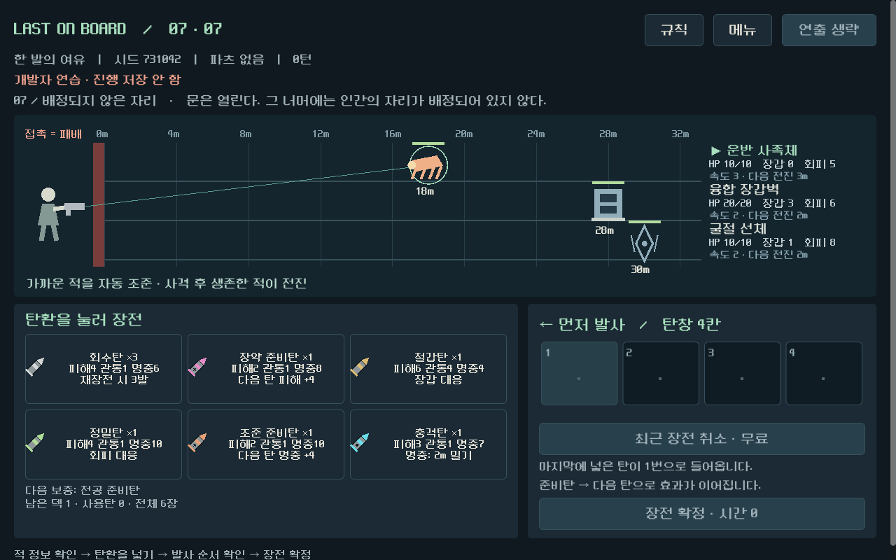
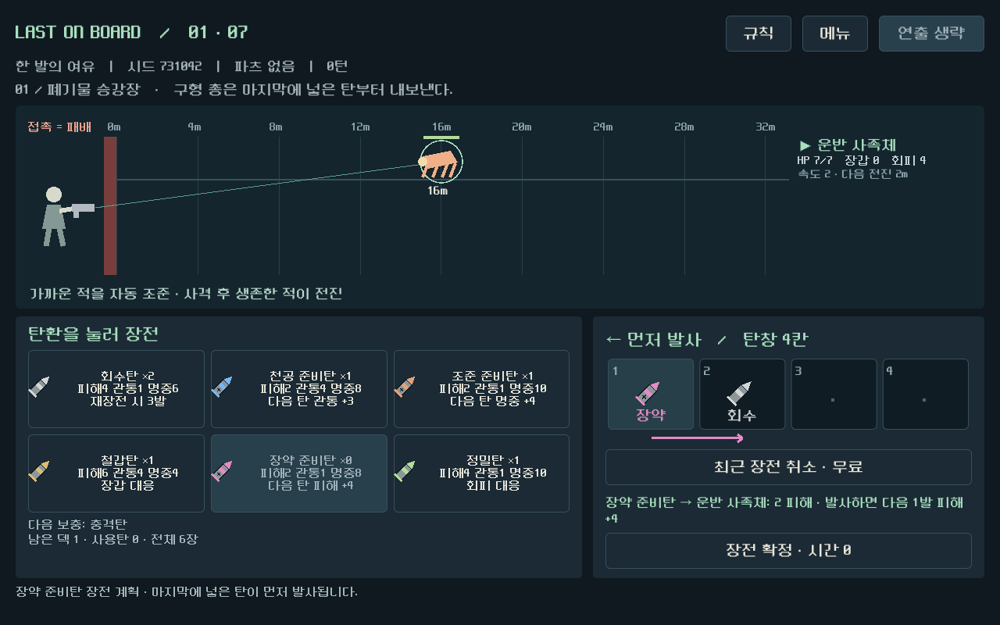

# Godot 시각 전투 개선 — 2026-09-11

텍스트로 결과만 읽던 재설계 후보에 거리 전장, 탄창, 순차 전투 연출을 적용했다. 개발 방향은 Godot 네이티브로 유지한다. 대상은 `prototype/core-redesign`이며 기존 main과 이전 실행 파일은 보존했다.

## 실행

`D:/ProjectLoB/worktrees/core-redesign/builds/visual-windows/Play-Visual.cmd`

런처와 같은 폴더의 `qa-profile`에 저장한다. 메뉴에서 새 게임·이어 하기·시드 지정·개발자 연습을 선택할 수 있다. 연습은 일반 진행을 저장하지 않는다.

적의 거리와 방어 수치를 보고 탄환을 누르면 탄창으로 이동한다. 마지막에 넣은 탄이 왼쪽 1번에서 먼저 발사된다. 준비탄과 다음 탄은 화살표로 연결된다. 장전 확정 후 발사하면 탄환 소모, 투사체, 피해·도탄·빗나감, 넉백, 살아남은 적의 접근이 순서대로 보인다. 상단의 연출 생략으로 재생을 빠르게 끝낼 수 있다.

## 구현과 보존 범위

- `redesign/battle_view.gd`: 거리 축·적 형태·조준선·피격/밀기/전진 재생.
- `redesign/magazine_view.gd`, `ammo_visual.gd`: 4칸 탄창·탄환 아이콘·준비 효과 연결·장전 이동.
- `redesign/screen.gd`: 모델을 한 번 정산하고 저장한 뒤 복제된 상태로 연출. 재생 중 중복 입력과 메뉴 전환 차단.
- 기존 2총기·8탄종·7교전 및 전투 규칙 유지. 모델 SHA256 `ACFD2C4183E437B5A4C761A6672FF74EC298B906A1262F6C8EFE77F0D5E0C789`로 변경 없음.

## 검증

| 검사 | 결과 | 범위 |
|---|---|---|
| 규칙 | 48 통과 / 0 실패 | 기존 모델 계약 |
| 화면 | 43 / 0 | 최종 배치·버튼·전환 |
| 연출 | 39 / 0 | 실제 첫 장전/사격, 명시적 효과 픽스처, 재생 결과 정합 |
| 전체 UI | 493 / 0 | 214버튼 행동, 두 총기 각각 7교전 완주, 저장/이어 하기 |
| 독립 정합 감사 | 100 / 0 | 재표적·부분 리로드·선행 저장·중복 입력·생략 |
| Windows 내보내기 | 통과 | 내장 PCK 및 실행 파일 headless 시작 |

전체 UI와 독립 정합 감사 이후 최종 변경은 적 정보 글자 좌표, 피격 문구 위치, 기본탄 툴팁이었다. 최종 변경 뒤 화면43·연출39를 다시 통과했다. 기존 프로젝트 전체 회귀3730은 이전 재설계 단계 결과이며 이번에 재실행한 수치가 아니다.

독립 화면 관찰에서 발견한 다중 적 정보 행 간격과 피격 문구/거리 눈금 중첩을 VIS-01로 기록하고 수정했다. 원본 [화면 검토](qa/reports/visual_combat_experience_2026-09-11.md), [후속 검토](qa/reports/visual_combat_experience_recheck_2026-09-11.md), [독립 정합 감사](qa/reports/visual_combat_consistency_2026-09-11.md)를 보존한다. 자동 실행 증거는 [연출](qa/reports/visual_combat_motion_2026-09-11.json), [전체 UI](qa/reports/visual_combat_ui_evidence_2026-09-11.json)에 있다.

실행 파일: `LastOnBoard-visual.exe`, 126661360바이트. SHA256: `7A6CCC13D11B593A95574509FF27256E95AE6BB07FAF7DD749C9C95BEEF504D6`. 재생성: `tools/export_windows_visual.ps1`.

## 다음 판단

현재 도형과 아이콘은 아트 이전의 플레이 검증용이다. 사람 플레이로 조합 성공감, 연출 속도, 반복 피로, 보상 선택을 확인해야 한다. 자동 완주는 전체 시드 승률이나 재미를 보장하지 않는다. 이번 작업에서 최종 아트·음향은 추가하지 않았다.
